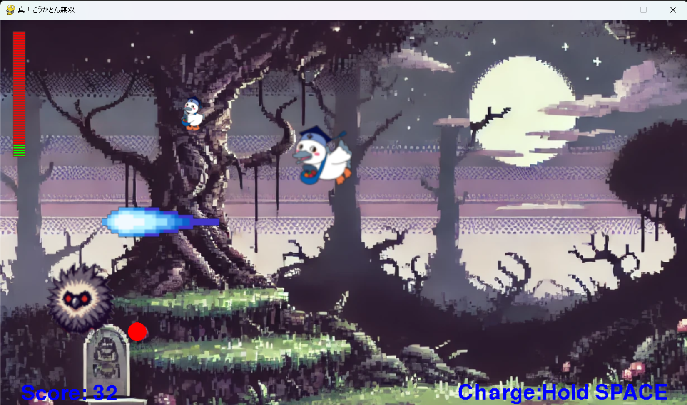

# ロックとん

## 実行環境の必要条件
* python >= 3.10
* pygame >= 2.1

## ゲームの概要
* ロックマンライクの2Dアクションゲーム

## ゲームの遊び方
* 左右矢印キーでこうかとんを操作
* 上矢印キーでジャンプ
* スペースキーで弾を撃つ
* スペースキー長押しでチャージショット
* ボスキャラクターの出す爆弾を撃つとスコアアップ
* ボスキャラクターを倒したらゲームクリア
* こうかとんのHPが0になったらゲームオーバー

## ゲームの実装
### 共通基本機能
* 背景画像とこうかとんの描画
* 矢印キーでこうかとんを動かす
* スペースキーでビーム発射
* 撃ち落とすとスコア加算
* 敵機が爆弾を発射
* （第四回演習のコード）

### 分担追加機能
* ジャンプ(C0B23085担当)
* ステージ(C0B23085担当)
* チャージショット(C0B23157担当)
* 体力(主人公は体力表示あり)(C0B23065担当)
* ボスキャラ(C0A23139担当)
* 回復アイテム（C0A23103担当）

### ToDo
- [ ] 敵のHPの表示
- [ ] 被弾時の無敵時間
- [ ] ボスの動きのランダム性
- [ ] 雑魚敵
- [ ] ステージの地形
- [ ] 道中ステージ
- [ ] ノックバック

### メモ
* 敵の大きさによってジャンプ力を調整する
